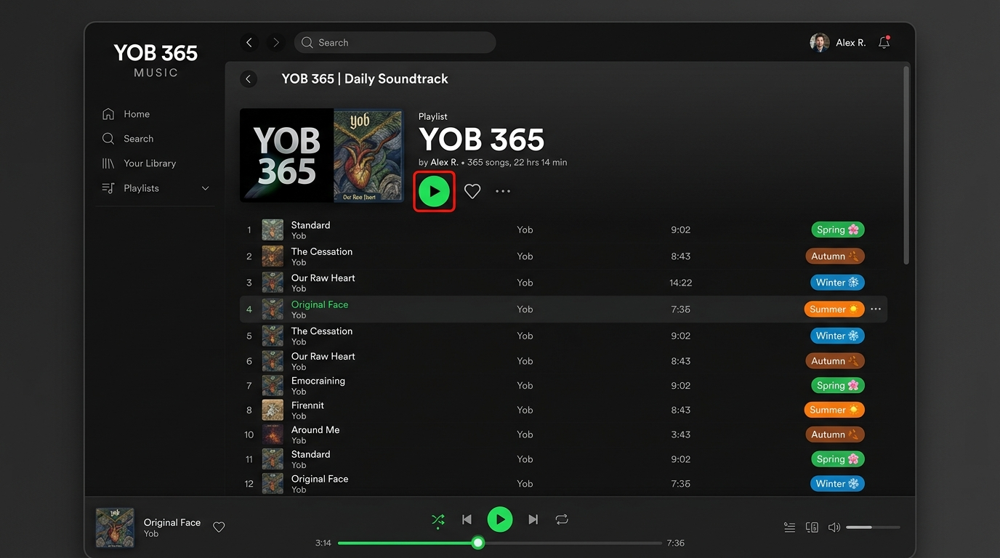

# YOB 365



A calendar-driven Spotify-styled music player with 365 daily tracks categorized across Spring, Summer, Autumn, and Winter seasons.

## Features

- **365 Calendar Compilation**: Daily track pairing mapped seamlessly across seasons.
- **Audio Engine**: Plays local music files (`.mp3`/`.wav`) with fallback harmonic synthesizer.
- **Player Suite**: Docked player, floating mobile mini-player, and full-screen theater mode.
- **Custom Playlists & Schemas**: Import and export custom JSON playlists and plain-text schemas with built-in validation.
- **Keyboard Shortcuts**: Full playback navigation (`Space`, `Ctrl + ←/→`, `S`, `R`, `M`, `F`, `C`).

## Getting Started

```bash
# Install dependencies
bun install # or npm install

# Start development server
bun run dev # or npm run dev

# Build for production
bun run build # or npm run build
```
